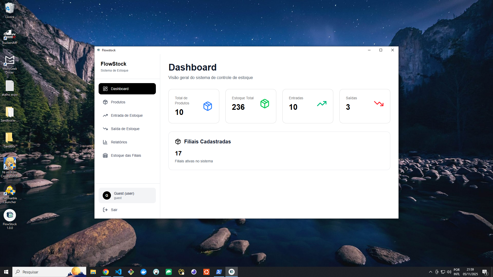
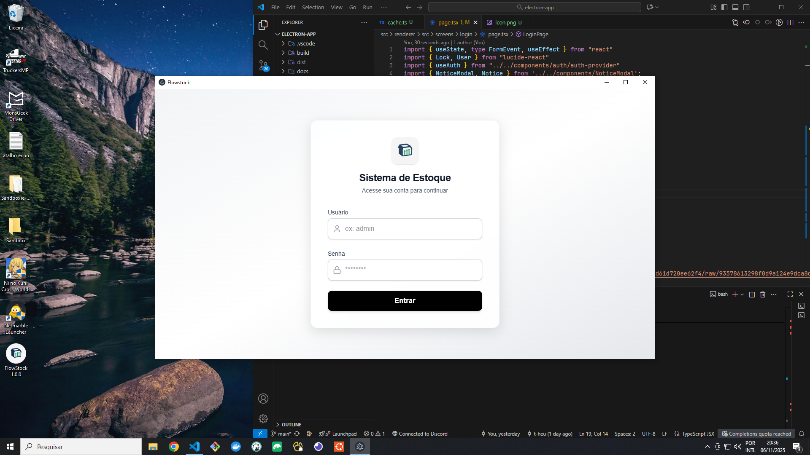

# Flowstock

An Electron application with React and TypeScript


## Recommended IDE Setup

- [VSCode](https://code.visualstudio.com/) + [ESLint](https://marketplace.visualstudio.com/items?itemName=dbaeumer.vscode-eslint) + [Prettier](https://marketplace.visualstudio.com/items?itemName=esbenp.prettier-vscode)

## 🖼️ Preview




## Project Setup

### Install

```bash
$ npm install
```

### Development

```bash
$ npm run dev
```

### Build

### Environment Setup

This project uses environment variables to configure secure and platform-dependent settings during the Electron build process.
Before running or building the application, you must create an environment file based on the provided template.

1. Copy the example environment file
```bash
cp .env.example electron-builder.env

# and
cp .env.example .env

```

```bash
# For windows - Abra PowerShell como Admin 
$ cd "C:\Users\SEU_NOME\www\flowstock-desktop"
$ Set-ExecutionPolicy -Scope Process -ExecutionPolicy Bypass
$ npm run build:win

# For macOS
$ npm run build:mac

# For Linux
$ npm run build:linux
```
